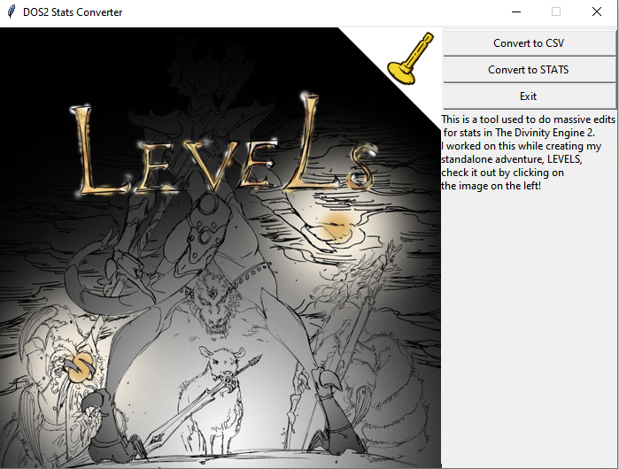

# DOS2- Stats Scripts
A simple script used to speed up the stats process for the development of a mod called [LEVELS](https://steamcommunity.com/sharedfiles/filedetails/?id=1886059329&searchtext=) for Divinity Original Sin 2 (DOS2). 
These scripts used to export stats file from the DOS2 engine into a csv format, which can be converted back into the stats file once edited with Excel or Python. Mainly for the purpose of editing, organizing or duplicating existing entries since the stats editor within the engine was slow when dealing with multiple records. This was my 1st attempt at adding a GUI to my code which combined the two separate scripts. If you want to check out my mod here is the link: [LEVELS](https://steamcommunity.com/sharedfiles/filedetails/?id=1886059329&searchtext=)

